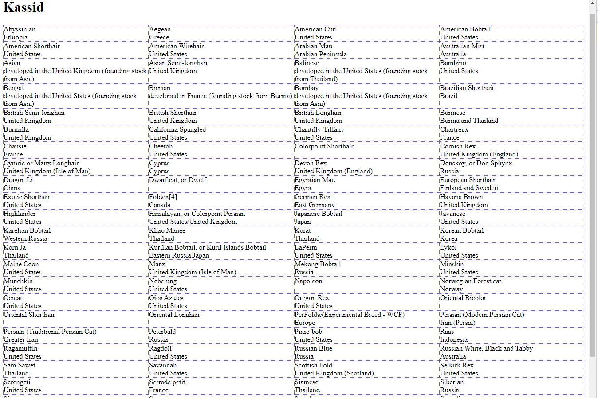

# tak22-hindamine

**For this assignment, it is allowed to use Google and AI tools**

* Fork this repository

* Make a local clone of the repository

* Open the code with an IDE, such as VSCode

* Open the app in web browser (Live server for example)

* Remember to use developer tools (!important)

* To better understand the code, you can use AI tools to add comments to the code

* Change the page heading to include your own name, and update the title to be more relevant

* Fix the bug related to the container id (JS can't find element with the "container" ID in HTML document)

* Create a layout for the cat breeds - use grid layout and divide the layout into four columns, as shown in this picture

* Add some air around the cat elements and remove the border

* In each element, emphasize the cat breed over country

* Once you have made the necessary changes, push the changes to your repository

* Publish on GitHub pages

* Send both links (to your repo and to GitHub pages) to Gen in Slack
# genjakassid.github.io
